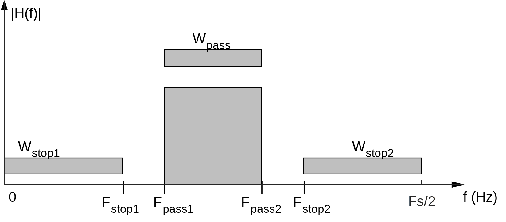

# Lab 3. Digital Filters

## Aim of the experiment

A goal of this experiment is to design discrete-time digital filters and implement them in real time.

In this experiment, you will design and implement finite impulse response (FIR) filters and infinite impulse response (IIR) filters in Matlab. You will measure the response of the filters using a variety of input test signals and quantify the change in magnitude response due to an increase in filter order.

## Reading assignment

* Digital Signal Processing using Arm Cortex-M based Microcontrollers by Cem Ünsalan, M. Erkin Yücel, H. Deniz Gürhan.
    * Chapter 4, sections 1-8
    * Chapter 7, sections 1-4
    * Chapter 8, sections 1-6

* Software Receiver Design by C. Richard Johnson, Jr., William A. Sethares and Andrew Klein
	* Chapter 3, sections 1-4
    * Chapter 4
    * Chapter 6, sections 1-2
    * Chapter 7
    
* Course reader
    * Lecture 3 slides on [Signals and Systems][1]
    * Lecture 5 slides on [Finite Impulse Response Filters][2]
    * Lecture 6 slides on [Infinite Impulse Response Filters][3]
    
## Lab 3 instructions: Week 1

### FIR filter design in MATLAB

We want to design a FIR bandpass filter using the following parameters:
* Design method: Parks-McClellan (a.k.a. equiripple)
* Filter order $N=30$ (the filter will have $N+1=31$ coefficients)
* Sampling Frequency $F_s= 44.1 \text{ kHz}$
* $F_{\text{stop1}}=5.9\text{ kHz}$
* $F_{\text{pass1}}=6\text{ kHz}$
* $F_{\text{pass2}}=16\text{ kHz}$
* $F_{\text{stop2}}=16.1\text{ kHz}$
* $W_{\text{stop1}}=W_{\text{pass}}=W_{\text{stop2}}$



1. Open the the MATLAB Filter Designer by calling the `filterDesigner` function. Enter the parameters and design the filter.

2. Export the coefficients to your workspace (File → Export → coefficients to workspace). The default variable name is `Num`, corresponding to the numerator of the transfer function.

   Later, we will experimentally measure the frequency response at 1000 Hz, 2000 Hz, $\ldots$, 19000 Hz, and 20000 Hz. In order to compare with our measurements, we need to first tabulate the theoretical response at these frequencies. Steps 3-5 describe this process.

3. Use the `freqz` function to get the response of the filter at 10 Hz intervals:

    ```
    [h,f] = freqz(Num,1,2205,44100);
    ```
4. Define a function to convert the frequency response values returned by freqz from complex values to magnitude values in dB:

    ```
    dB = @(x) 20*log10(abs(x));
    ```
5. Tabulate the theoretical magnitude response of this filter at 1000 Hz increments up to 20 kHz:

    ```
    freq = f(101:100:2001);
    resp_dB = dB(h(101:100:2001));
    table(freq,resp_dB)
    ```
    
    You may find it helpful to export the values to a spreadsheet so that you can record the measured values in a new column later. You can use the `xlswrite` function to export the data to a spreadsheet
    
    ```
    xlswrite('theoretical_response.xlsx',[freq,resp_dB]);
    ```
    
    **Include the tabulated values of the theoretical magnitude response in your lab report**     
    
6. We will need to define an array in C containing these coefficients. You can use the `sprintf` command in MATLAB to generate a comma separated string which you can copy into your C code:

    ```
    sprintf('%f,',Num)
    ```

### FIR filter implementation in C

1. In lab.c, define an array containing your filter coefficients.

    ```
    float32_t b[31] = {<coefficients>};
    ```
    
2. In lab.c, define variables corresponding to the state values of the filter. An good convention is to create an array `x` where `x[0]` corresponds with $x[n]$, `x[1]` corresponds with $x[n-1]$, and so on. Initialize your variables so that all initial conditions are zero. An easy way to do this is with the 'universal zero initializer' `{0}`, e.g. 

    ```
    float32_t x[31] = {0};
    float32_t y = 0;
    ```
    
3. In lab.c, modify the process_left_sample function to implement the filter as a tapped delay line.

    
    
    1. Each time the process_left_sample function is called, we are given a new input sample from the ADC which is a 16-bit signed integer. Convert this value to floating point, apply the appropriate scaling, and store it into the array location corresponding to $x[n]$
    
    ```
    x[0] = (float32_t) input_sample) / SCALING_FACTOR;
    ```

    2. Each time the process_left_sample function is called, we need to calculate the value of $y[n]$ from a summation. Assign `y` a value of zero to 'reset' the summation.
    
    3. Create a for loop to perform the summation for the output of the tapped delay line
    
        $$y[n] = \sum_{i=0}^{N}{b_ix[n-i]}$$
    
    4. After computing $y[n]$ we need to move the variables down the delay line. Create another for loop that reassigns the state variables to prepare them for the next output when process_left_sample is called again. (Hint: use a down counting for loop.)
    
4. Connect the signal generator (set to 10 kHz) as the input and the oscilloscope as the output. Verify the operation of the program. (Since 10kHz is in the passband, you should see the signal on the output).

5. Measure the frequency response of your filter at 1 kHz increments up to 20 kHz by changing the frequency on the signal generator and measuring the amplitude of the output signal. **Include the measured values in your lab report.**

6. Convert the amplitude values you measured to decibels. Since your measurement is a voltage and decibels are a ratio of power, the conversion is:

    $$\left| H \right|_{\text{dB}} = 10\log_{10}\left(\frac{P_{\text{out}}}{P_{\text{in}}}\right)= 20\log_{10}\left(\frac{V_{\text{out}}}{V_{\text{in}}}\right)$$
    
    The value for $V_{\text{out}}$ is your measurement. Check the setting your signal generator to determine $V_{\text{in}}$.
    
7. Plot the values of your measured response on top of or next to the values of the theoretical response. **Include this plot in your lab report.**

## Lab 3 instructions: Week 2

### Frame-based FIR filter

The starter code uses the DMA controller to move blocks of data (also called frames) between the ADC, main memory and DAC. In this exercise, we will implement the same FIR bandpass filter, but apply it to entire frames of data rather than sample-by-sample. To achieve this, we will put our filter in the process_input_buffer function rather than the process_left_sample function.
  
1. We will use the ARM CMSIS DSP library to perform filtering on a frame of data. Take a moment to read the [description of the FIR filter functions][4] in this library.

2. In lab.c, initialize the variables necessary to use the `arm_fir_f32` function

    1. Create buffers for the input and output of the filter.
    
        ```
        float32_t filter_in[FRAME_SIZE/4] = {0};
        float32_t filter_out[FRAME_SIZE/4] = {0};
        ```
        
        *(The FRAME_SIZE constant specified in lab.h corresponds to the length of the entire circular buffer for both left and right channels. When one half of the circular buffer is accumulating data, we will work with the other half. Additionally, we are only working with one of the two channels. This is why our arrays are of length FRAME_LENGTH/4).*
        
    2. Create a buffer for the filter state
    
        ```
        float32_t state[31+(FRAME_SIZE/4)-1] = {0};
        ```
        
        *(The arm_fir_f32 function uses a state buffer of length num_taps+block_size-1 to implement the filter more efficiently.)*
        
    3. Create a filter instance struct.
    
        ```
        arm_fir_instance_f32 filter_instance;
        ```
        
3. In lab.c, initialize the filter instance in the lab_init function

    ```
    arm_fir_init_f32(&filter_instance, 31, b, state, FRAME_SIZE/4);
    ```

5. In lab.c, modify the process_input_buffer function to perform the filtering

    1. Fill your filter_in buffer with the samples from the left channel.
    
        ```
        for (uint32_t i_sample = 0; i_sample < FRAME_SIZE/2; i_sample+=2)
        {
            filter_in[i_sample/2] = ((float32_t)input_buffer[i_sample])/SCALING_FACTOR;
        }
        ```
    2. Perform the filtering.
        
        ```
        arm_fir_f32(&filter_instance, filter_in, filter_out, FRAME_SIZE/4);
        ```
        
    3. Copy the filter output buffer back to the array used by the DMA controller.
    
        ```
        for (uint32_t i_sample = 0; i_sample < FRAME_SIZE/2; i_sample+=1)
        {
             input_buffer[i_sample] = SCALING_FACTOR*filter_out[i_sample/2];
             i_sample+=1;
             input_buffer[i_sample] = 0;
        }
        ```
        
6. Connect the signal generator as the input and the oscilloscope as the output. Verify the operation of the program by sweeping through different frequencies and observing the response.

## Lab 3 instructions: Week 3

### IIR filter design in MATLAB

### IIR filter implementation

## Lab report contents

Be sure to include everything listed in this section when you submit your lab report. The goal of the report is to help cement what you learned in memory. For sections I, II, and IV, imagine your audience is a student who is your peer but who has not yet completed the lab.

### I. Introduction

Briefly explain the theory and algorithms behind the programs that you wrote. The slides and reading material might help you in writing this section.

### II. Methods

Describe the steps you took to implement the algorithms in your own words.

### III. Results from lab exercise

Present the results you obtain for each task on the assignment sheet. This section should include illustrative oscilloscope screenshots of the DSP algorithms in action. Also include any code that you wrote or modified. Please do not include all of the boilerplate code from the textbook.

In addition to the code you modified, make sure to include.

1. Theoretical magnitude response values of bandpass filter (tabulated).

2. Measured magnitude response values of bandpass filter (tabulated).

3. Plot of theoretical response on top of or next to a plot of your measured response.
    
### IV. Discussion

In this section, discuss the takeaway from each lab. You can mention any intuition that you developed. Also mention any problems that you faced and how you rectified them.

### V. Assignment questions

Please answer the following questions.

[1]:http://users.ece.utexas.edu/~bevans/courses/realtime/lectures/03_Signals_Systems/lecture3.pptx
[2]:http://users.ece.utexas.edu/~bevans/courses/realtime/lectures/05_FIR_Filters/lecture5.pptx
[3]:http://users.ece.utexas.edu/~bevans/courses/realtime/lectures/06_IIR_Filters/lecture6.ppt
[4]:https://www.keil.com/pack/doc/CMSIS/DSP/html/group__FIR.html