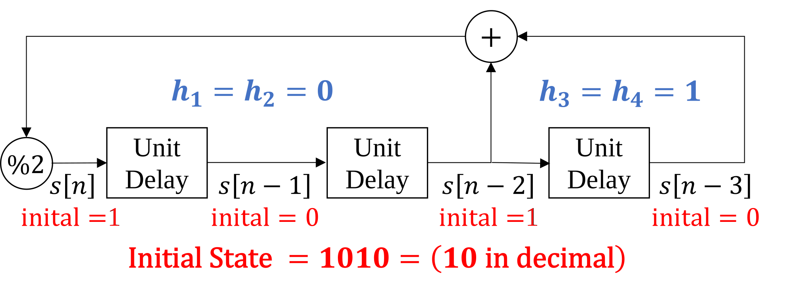

# Lab 4 Primer

Pseudo-random binary sequences are also known as pseudo-noise (PN) sequences because the sequences resemble noise. These binary sequences appear to be random but instead have structure. They have all frequencies present; i.e., there are no nulls in the magnitude spectrum.

## Applications of Pseudo-Random Binary Sequences

PN sequences are widely used to

* generate test, measurement and calibration signals
* generate training signals in communication systems
* scramble and descramble data in communication systems

### As a signal for test, measurement, and calibration
The first application is to use a PN sequence to estimate an impulse response of an unknown subsystem, e.g. the cascade of a source, empty chamber, and receiver in a biomedical instrument. Once the impulse response is known, calibration of the system can proceed by means of a linear time-invariant filter in the transmitter (known as a predistorter) or receiver (known as an equalizer) to compensate for the distortion in the subsystem.

### As a training signal
As a training signal, the PN sequence would be the digital data to be transmitted over the unknown communication channel. The receiver knows the bits that had been transmitted, and can use that knowledge to adapt receiver settings to improve communication performance (signal quality). The receiver can also estimate the impulse response of the communication channel if needed.

### Data scrambler/descrabler
In data scramblers, PN sequences are used to prevent long strings of 0's and 1's. For baseband transmission, during a long string of 0's or 1's, the primary frequency component in the signal would be at DC, and DC does not get passed by some communication channels (e.g. voiceband and acoustic channels). For bandpass transmission, during a long string of 0's or 1's, the primary frequency of the message signal (DC) would be upconverted to sit at the carrier frequency. This presents at least two problems:

* The receiver may have more difficulty for the receiver to lock onto the carrier frequency and phase
* The receiver will have greater difficulty performing symbol synchronization if the symbol synchronization algorithm uses frequency content at the transmission bandwidth's edges for the symbol timing estimate.

The primary application of PN sequences in lab #4 is for data scrambling and descrambling.

## Linear-feedback shift register (LFSR)

In lab #4, we will use a a Fibonacci LFSR to (1) generate PN sequences , (2) scramble data, and (3) descramble data. This structure shares many similarities to the tapped delay line for filtering. Like the tapped delay line, the Fibonacci LFSR maintains a delay line of $m$ elements $s[n], s[n-1], \ldots, s[n-m]$. Unlike the tapped delay line for LTI filters, the values are restricted to be binary (zero or one). Instead of real-valued coefficients, the LFSR has a set of taps $h_1, h_2, \ldots, h_m$ which also have a binary state (connected or disconnected). Since all values are binary, additions are performed modulo two (equivalent to XOR).

### LFSR for PN sequence generation

To generate on sample of a PN sequence, we must

1. Set the initial values $s[0], s[-1], \ldots, s[-m]$ appropriately (discussed later).

2. Compute the addition modulo 2, equivalent to a series of XOR ($\oplus$) operations, of the connected taps in the shift register:

    $$ s[n] = \left( \sum_{k=1}^{m}{h_k s[n-k]} \right) \text{ mod } 2 = \bigoplus_{k=1}^{m}{h_k s[n-k]}$$

3. Shift each value along the delay line. The sample that would 'fall off' the delay line, $s[n-m]$, is conventionally taken as the output sample $y[n]$ of the system.

With an appropriate choice of connected taps $h_k$ and initial values of $s$, a PN sequence generated using this method will be $2^{m-1}$ periodic. In this case, it is said to be maximal length.

Proving the maximal length property mathematically for a particular configuration is difficult. For engineering applications, we can use known configurations which are known to provide this property. For example, the following configuration results in a maximal length ($2^{4-1} = 15$) PN sequence:

The first period of the this LFSR is listed below.

| $n$  	| $s[n]$ 	| $s[n-1]$ 	| $s[n-2]$ 	| $s[n-3]$ 	| $y[n]$ 	|
| :--- 	| :----: 	| :----: 	| :----: 	| :----: 	| :----: 	|
| 0 	| 1 		| 0 		| 1 		| 0 		|   		|
| 1 	| 1 		| 1 		| 0 		| 1 		| 0 		|
| 2 	| 1 		| 1 		| 1 		| 0 		| 1 		|
| 3 	| 1 		| 1 		| 1 		| 1 		| 0 		|
| 4 	| 0 		| 1 		| 1 		| 1 		| 1 		|
| 5 	| 0 		| 0 		| 1 		| 1 		| 1 		|
| 6 	| 0 		| 0 		| 0 		| 1 		| 1 		|
| 7 	| 1 		| 0 		| 0 		| 0 		| 1 		|
| 8 	| 0 		| 1 		| 0 		| 0 		| 0 		|
| 9 	| 0 		| 0 		| 1 		| 0 		| 0 		|
| 10 	| 1 		| 0 		| 0 		| 1 		| 0 		|
| 11 	| 1 		| 1 		| 0 		| 0 		| 1 		|
| 12 	| 0 		| 1 		| 1 		| 0 		| 0 		|
| 13 	| 1 		| 0 		| 1 		| 1 		| 0 		|
| 14 	| 0 		| 1 		| 0 		| 1 		| 1 		|
| 15 	| 1 		| 0 		| 1 		| 0 		| 1 		|

### LFSR for data scrambler and descrambler