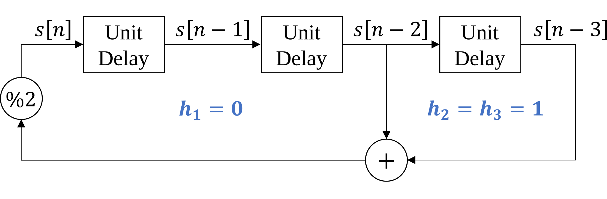

# Lab 4 Primer

Pseudo-random binary sequences are also known as pseudo-noise (PN) sequences because the sequences resemble noise. These binary sequences appear to be random but instead have structure. They have all frequencies present; i.e., there are no nulls in the magnitude spectrum.

## Applications of Pseudo-Random Binary Sequences

PN sequences are widely used to

* generate test, measurement and calibration signals
* generate training signals in communication systems
* scramble and descramble data in communication systems

### As a signal for test, measurement, and calibration
The first application is to use a PN sequence to estimate an impulse response of an unknown subsystem, e.g. the cascade of a source, empty chamber, and receiver in a biomedical instrument. Once the impulse response is known, calibration of the system can proceed by means of a linear time-invariant filter in the transmitter (known as a predistorter) or receiver (known as an equalizer) to compensate for the distortion in the subsystem.

### As a training signal
As a training signal, the PN sequence would be the digital data to be transmitted over the unknown communication channel. The receiver knows the bits that had been transmitted, and can use that knowledge to adapt receiver settings to improve communication performance (signal quality). The receiver can also estimate the impulse response of the communication channel if needed.

### Data scrambler/descrabler
In data scramblers, PN sequences are used to prevent long strings of 0's and 1's. For baseband transmission, during a long string of 0's or 1's, the primary frequency component in the signal would be at DC, and DC does not get passed by some communication channels (e.g. voiceband and acoustic channels). For bandpass transmission, during a long string of 0's or 1's, the primary frequency of the message signal (DC) would be upconverted to sit at the carrier frequency. This presents at least two problems:

* The receiver may have more difficulty for the receiver to lock onto the carrier frequency and phase
* The receiver will have greater difficulty performing symbol synchronization if the symbol synchronization algorithm uses frequency content at the transmission bandwidth's edges for the symbol timing estimate.

The primary application of PN sequences in lab #4 is for data scrambling and descrambling.

## Linear-feedback shift register (LFSR)

In Lab #4, we will use a a Fibonacci LFSR to (1) generate PN sequences, (2) scramble data, and (3) descramble data. This structure shares many similarities to the tapped delay line for filtering. Like the tapped delay line, the Fibonacci LFSR maintains a delay line of $m$ elements $s[n-1], s[n-2], \ldots, s[n-m]$. Unlike the tapped delay line for LTI filters, the values are restricted to be binary (zero or one). Instead of real-valued coefficients, the LFSR has a set of taps $h_1, h_2, \ldots, h_m$ which also have a binary state (connected or disconnected). Since all values are binary, additions are performed modulo two (equivalent to an exclusive or).

### LFSR for PN sequence generation

The procedure to produce a PN sequence using the LFSR consists of three steps:

1. Set the initial values $s[-1], s[-2], \ldots, s[-m]$ so that at least one is nonzero.

2. Compute the addition modulo 2, equivalent to a series of exclusive or ($\oplus$) operations, of the connected taps in the shift register:

    $$ s[n] = \left( \sum_{k=1}^{m}{h_k s[n-k]} \right) \text{ mod } 2 = \bigoplus_{k=1}^{m}{h_k s[n-k]}$$

3. Shift each value along the delay line (i.e. increment n), then repeat starting from step two.

With an appropriate choice of connected taps, the LFSR state will cycle through each of the $2^m - 1$ possible (nonzero) combinations of $m$ bits. In this case, we call the system a maximal-length LFSR, and $s[n]$ is a $(2^m -1)$-periodic PN sequence.

Determining mathematically if a combination of taps produces a maximal length sequence is difficult. However, for engineering applications, we can use configurations which are known to provide this property. For example, the following configuration results in a maximal length PN sequence with period $2^3 -1 = 7$.

The first period of the this LFSR is listed below.

|$n$	|$s[n]=s[n-2]\oplus[n-3]$	|$s[n-1]$			|$s[n-2]$			|$s[n-3]$			|
|:---	|----:						|:----:				|:----:				|:----:				|
|0		|
1
			|
1
	|
0
	|
1
	|
|1		|
1
			|
1
	|
1
	|
0
	|
|2		|
0
			|
1
	|
1
	|
1
	|
|3		|
0
			|
0
	|
1
	|
1
	|
|4		|
1
			|
0
	|
0
	|
1
	|
|5		|
0
			|
1
	|
0
	|
0
	|
|6		|
1
			|
0
	|
1
	|
0
	|
|7		|
1
			|
1
	|
0
	|
1
	|

### Auto-correlation of PN sequence

In order to understand some of the useful properties of PN sequences, we need to first define the auto-correlation operation, which is closely related to convolution.

#### Convolution

Recall that the convolution operation (denoted using $*$) for two discrete-time signals is defined as:

$$x_1[n]*x_2[n] = \sum_{k=-\infty}^{\infty}x_1[k]x_2[n-k]$$

This operation is often described as 'flip and slide', since $x_2[n-k]$ is a reversed and shifted version of $x_2[k]$.

#### Cross-correlation

The cross-correlation operation (denoted using $\star$) is nearly identical to convolution, but without the 'flip'.

$$x_1[n]\star x_2[n] = \sum_{k=-\infty}^{\infty}\overline{x_1[k]}x_2[n+k]$$

*Note: $\overline{x_1[k]}$ denotes the complex conjugate of $x_1[k]$, but for real valued signals $\overline{x_1[k]}=x_1[k]$.*

#### Auto-correlation

The auto-correlation $R[k]$ of a discrete-time signal $x[n]$ is the cross-correlation with itself:

$$R[k] = x[n]\star x[n] = \sum_{k=-\infty}^{\infty}\overline{x[k]}x[n+k]$$

#### Auto-correlation of a PN maximal length PN sequence

#### Maximal-length PN sequences

### LFSR for data scrambler and descrambler