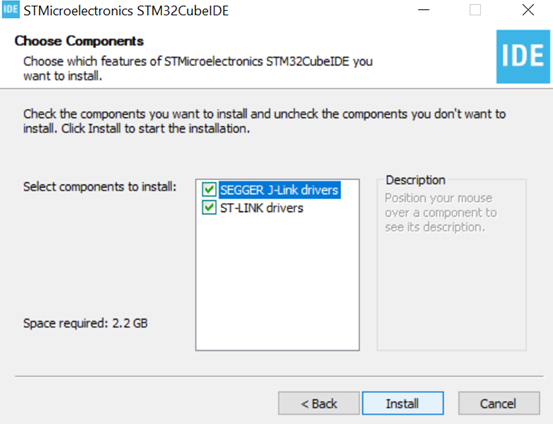
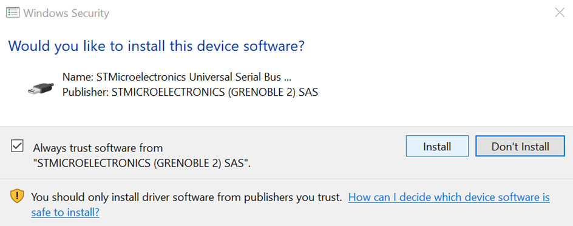

# STM32H735G Discovery Kit Setup Guide

This guide will walk you through the steps needed to install and import a project with the STM32CubeIDE software.

## STM32CubeIDE Installation

The easiest way to program the discovery board is with the [STM32CubeIDE][2] Software.

The software is free and available on Windows, Mac OS, and Linux, but you will need to either register an account with ST of provide your email to access it. 

When installing, make sure to install the suggested components: SEGGER J-Link drivers and ST-Link Drivers.



Your operating system may prompt you for additional permission when installing the drivers with a prompt similar to the one below. Make sure you allow the installation.



When you run the program for the first time, you will be prompted to select a workspace. **Make sure you note the location of your workspace.** This is where your projects for the lab assignments will reside. The default location is ```<user>/STM32CubeIDE/workspace_<version>```, but feel free to choose a more convenient location since you will access it often for the lab exercises.

## Importing the Starter Code

We have provided a project that contains all of the starter code necessary to complete the lab exercises. With it, we have included a short matlab script that will help you import the code to the IDE for each lab while avoiding naming conflicts.

If you do not already have a working installation of MATLAB, follow the [instructions on the course webpage][2].

Download the [zip file containing the starter code and setup script][3].

[1]:https://www.st.com/en/development-tools/stm32cubeide.html
[2]:http://users.ece.utexas.edu/~bevans/courses/realtime/homework/matlab.html
[3]:http://72.179.3.141:9997/445S_lab_files.zip