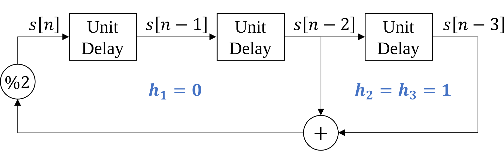

# Lab 4 Primer

Pseudo-random binary sequences are also known as pseudo-noise (PN) sequences because the sequences resemble noise. These binary sequences appear to be random but instead have structure. They have all frequencies present; i.e., there are no nulls in the magnitude spectrum.


## Applications of Pseudo-Random Binary Sequences

PN sequences are widely used to

* generate test, measurement and calibration signals
* generate training signals in communication systems
* scramble and descramble data in communication systems

### As a signal for test, measurement, and calibration
The first application is to use a PN sequence to estimate an impulse response of an unknown subsystem, e.g. the cascade of a source, empty chamber, and receiver in a biomedical instrument. Once the impulse response is known, calibration of the system can proceed by means of a linear time-invariant filter in the transmitter (known as a predistorter) or receiver (known as an equalizer) to compensate for the distortion in the subsystem.

### As a training signal
As a training signal, the PN sequence would be the digital data to be transmitted over the unknown communication channel. The receiver knows the bits that had been transmitted, and can use that knowledge to adapt receiver settings to improve communication performance (signal quality). The receiver can also estimate the impulse response of the communication channel if needed.

### Data scrambler/descrabler

The primary application of PN sequences in lab #4 is for data scrambling and descrambling. As a data scrambling sequence, pseudonoise can (1) eliminate strong DC components (long strongs of zeros and ones) in the baseband signal and (2) disperse the power spectrum to mitigate the effects of certain channel impairments. 

1. **Eliminating DC components**

    During a long string of zeros or ones, the primary frequency component in the signal would be at DC. For baseband transmission, this would not get passed by some communication channels (e.g. voiceband and acoustic channels). Some automatic gain control algorithms will also fail in the presence of a strong DC components. For bandpass transmission, the DC component is upconverted to sit at the carrier frequency. Strong components at this frequency will hinder the clock recovery and symbol synchronization subsystems.

2. **Mitigating channel impairments**

    If a baseband signal has most of its power concentrated at specific frequencies, scrambling with a PN sequence can help disperse the spectrum to mitigate certain channel impairments. For example, a common impairment caused by nonlinearity or time-variance is intermodulation, or cross-modulation. The effect of intermodulation is greatly reduced by dispersing the power spectrum and eliminating signal components concentrated at specific frequencies.

## Linear-feedback shift register (LFSR)

In Lab #4, we will use a a Fibonacci LFSR to (1) generate PN sequences, (2) scramble data, and (3) descramble data. This structure shares many similarities to the tapped delay line for filtering. Like the tapped delay line, the Fibonacci LFSR maintains a delay line of $m$ elements $s[n-1], s[n-2], \ldots, s[n-m]$. Unlike the tapped delay line for LTI filters, the values are restricted to be binary (zero or one). Instead of real-valued coefficients, the LFSR has a set of taps $h_1, h_2, \ldots, h_m$ which also have a binary state (connected or disconnected). Since all values are binary, additions are performed modulo two (equivalent to an exclusive or).


### LFSR for PN sequence generation

The procedure to produce a PN sequence using the LFSR consists of three steps:

1. Set the initial values $s[-1], s[-2], \ldots, s[-m]$ so that at least one is nonzero.

2. Compute the addition modulo 2, equivalent to a series of exclusive or ($\oplus$) operations, of the connected taps in the shift register:

    $$ s[n] = \left( \sum_{k=1}^{m}{h_k s[n-k]} \right) \text{ mod } 2 = \bigoplus_{k=1}^{m}{h_k s[n-k]}$$

3. Shift each value along the delay line (i.e. increment n), then repeat starting from step two.

With an appropriate choice of connected taps, the LFSR state will cycle through each of the $2^m - 1$ possible (nonzero) combinations of $m$ bits. In this case, we call the system a maximal-length LFSR, and $s[n]$ is a $(2^m -1)$-periodic PN sequence.

Determining mathematically if a combination of taps produces a maximal length sequence is difficult. However, for engineering applications, we can use configurations which are known to provide this property. For example, the following configuration results in a maximal length PN sequence with period $2^3 -1 = 7$.

The first period of the this LFSR is listed below.

<center>

|$n$	|$s[n]=s[n-2]\oplus[n-3]$	|$s[n-1]$			|$s[n-2]$			|$s[n-3]$			|
|:---	|----:						|:----:				|:----:				|:----:				|
|0		|<center>1</center>			|<center>1</center>	|<center>0</center>	|<center>1</center>	|
|1		|<center>1</center>			|<center>1</center>	|<center>1</center>	|<center>0</center>	|
|2		|<center>0</center>			|<center>1</center>	|<center>1</center>	|<center>1</center>	|
|3		|<center>0</center>			|<center>0</center>	|<center>1</center>	|<center>1</center>	|
|4		|<center>1</center>			|<center>0</center>	|<center>0</center>	|<center>1</center>	|
|5		|<center>0</center>			|<center>1</center>	|<center>0</center>	|<center>0</center>	|
|6		|<center>1</center>			|<center>0</center>	|<center>1</center>	|<center>0</center>	|
|7		|<center>1</center>			|<center>1</center>	|<center>0</center>	|<center>1</center>	|

</center>

Typically, we map the binary $\left\{ 0,1 \right\}$ values to symmetric amplitudes $\left\{ -1,1 \right\}$ when representing the PN sequence as a signal.

### Auto-correlation of PN sequence

In order to understand some of the useful properties of PN sequences, we need to first define the auto-correlation operation, which is closely related to convolution.

#### Convolution

Recall that the convolution operation (denoted using $*$) for two discrete-time signals is defined as:

$$x_1[n]*x_2[n] = \sum_{k=-\infty}^{\infty}x_1[k]x_2[n-k]$$

This operation is often described as 'flip and slide', since $x_2[n-k]$ is a reversed and shifted version of $x_2[k]$.

#### Cross-correlation

The cross-correlation operation (denoted using $\star$) is nearly identical to convolution, but without the 'flip'.

$$x_1[n]\star x_2[n] = \sum_{k=-\infty}^{\infty}\overline{x_1[k]}x_2[n+k]$$

*Note: $\overline{x_1[k]}$ denotes the complex conjugate of $x_1[k]$, but for real valued signals $\overline{x_1[k]}=x_1[k]$.*

#### Auto-correlation

The auto-correlation $R_{xx}[k]$ of a discrete-time signal $x[n]$ is the cross-correlation with itself:

$$R_{xx}[k] = x[n]\star x[n] = \sum_{k=-\infty}^{\infty}\overline{x[k]}x[n+k]$$

For periodic signals the summation can be simplified, and the result is often normalized by the period $N$.

$$R_{xx}[k] \text{ for periodic signal} = \frac{1}{N}x[n]\star x[n] = \frac{1}{N}\sum_{k=1}^{N}\overline{x[k]}x[n+k]$$

#### Auto-correlation of a maximal length PN sequence

Applying the formula above to the maximal length PN sequence from the earlier example yields the following (normalized) auto-correlation:


The auto-correlation for this PN sequence is equal to one at integer multiples of the period $N$ and is equal to $\frac{-1}{N}$ for all other offsets. This behavior is the same for *all* maximal-length PN sequences, as long as the following two conditions are met:

1. The values of the binary PN sequence are mapped to $\left\{ -1,1 \right\}$. We avoid representing the sequence with $\left\{ 0,1 \right\}$ because this would introduce a DC component.

2. The auto-correlation is taken of the infinite-length, periodically extended sequence. The auto-correlation of just one period can also be computed, but its properties will be different.

### Data scrambling

Suppose we have a binary data sequence $x[n]$ that we want to transmit. We can scramble the data by adding (modulo two) a scrambling sequence $s[n]$.

$$x_s[n] = ( x[n] + s[n] ) \text{ mod 2} = x[n] \oplus s[n]$$

When $s[n]$ is a PN sequence, the scrambler will (1) eliminate strong DC components (long strongs of zeros and ones) in the baseband signal and (2) disperse the power spectrum to mitigate the effects of certain channel impairments. 

We can 'undo' the scrambler (i.e. descramble the data) using the same process:

$$x_d[n] = ( x_s[n] + s[n] ) \text{ mod 2} = x_s[n] \oplus s[n]$$

If the same scrambling sequence $s[n]$ is used for the scrambler and descrambler, then $x_d[n]=x[n].$
By initializing two two LFSRs (one at the transmitter and one at the receiever) with the same initial conditions and connected taps $h_k$, this process can be made extremely efficient.

## Implementation of LFSR in C

In lab #4, you will implement the LFSR in C. To prepare, it is useful to review some topics in C programming.

### Bits, words, and arrays

Although it would be convenient to think of our generated PN sequence as an 'array of bits' there is no datatype in C that would allow this, since the smallest addressable unit of data in C is a byte (8 bits).

Typically, we refer to the unit of addressable data in an array as a 'word'. For example, if we have an array of ```int16_t```s, then we would say that $1 \text{ word} = 16 \text{ bits}$. If the array is composed of ```float32_t```s, then $1 \text{ word} = 32 \text{ bits}$, and so on.

If we need to address individual bits in a long sequence of data in C, we can instead create an array of conveniently sized words and use bitwise operations to access individual bits in each word.

### Review of bitwise operations in C

There are six bitwise operations in c: *and* `&`, *or* `|`, *xor* `^`, *left shift* `<<`, *right shift* `>>`, and *not*`~`.

Most of these behave as you would expect, but the right shift `>>` is an exception. The behavior of the right shift ```>>``` operation depends on if the datatype is signed or unsigned, and varies depending on the compiler used. This is because there are two possible behaviors for the right shift operation

1. In a logical right shift, the most significant bit receives a value of zero. This is the behavior that occurs when operating on an unsigned datatype.

2. In an arithmetic right shift, the most significant bit (which is the sign bit for signed datatypes) is unchanged.

*Takeaway: use unsigned datatypes when implementing the LFSR in C to ensure that all shifts are logical shifts.*

For left shift operations, the least significant bit always receives a value of zero in C, regardless of the data type.

### Addressing individual bits

There are many ways to use the bitwise operations above to perform addressing of individual bits. The easiest way to demonstrate is with an example. Suppose we have a variable `x` in C with the datatype `uint32_t` and we want to perform the following operation:

*Example operation: Set the 6th least significant bit equal to the xor of the 4th and 2nd least significant bits.* 

Let's outline one approach:

1. Create expressions corresponding to the 4th and 2nd least significant bits shifted to the least significant position:

    `x>>3` and `x>>1`

2. Calculate the bitwise XOR of these expressions:

    ```
    (x>>3) ^ (x>>1)
    ```

3. Mask out all other bits

    ```
    ( (x >> 3) ^ (x >> 1) ) & 1
    ```

4. Shift the expression to the desired position

    ```
    ( ( (x >> 3) ^ (x >> 1) ) & 1 ) << 5
    ```

5. Assign the result back to `x`

    ```
    x |= ( ( (x >> 3) ^ (x >> 1) ) & 1 ) << 5
    ```

At this point, the code has become very difficult to read! Although whitespace does not change the behavior, it can make the code somewhat more readable.

```
x |= (
       ( 
         (x >> 3) ^ (x >> 1) 
       ) & 1
     ) << 5
```

There are many other ways that this operation can be completed in C, so it can be helpful to try multiple approaches until you find a style you are comfortable with.