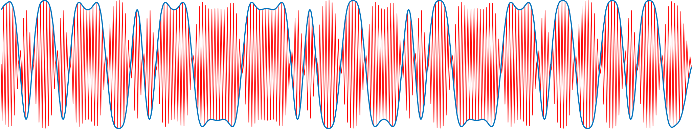

# Lab 5 Primer

The range of complexity for a pulse amplitude modulation (PAM) transceiver system can vary drastically. A working version that demonstrates the core principles can be simulated with just a few lines of code. In practice, many additional subsystems need to be added for reliable operation.

## Simulation

In simulation, pulse amplitude modulation is relatively straightforward, and can be achieved with just a handful steps.

### 1. Mapping data to pulses

The first step in any digital communication system is [serialization][1], the process of converting a useful data structure into a stream of bits. For example, the following MATLAB code serializes the ascii string "meatball" into an array of 56 bits.

```
>> serialized_data = reshape((dec2bin(uint8('meatball'))'),[1,56])

serialized_data =

    '11011011100101110000111101001100010110000111011001101100'

```

In 2-PAM, we map a bit of '0' to a pulse with an amplitude $-d$ and a bit of one to a pulse with an amplitude of $+d$. A common pulse shape is the [raised cosine][2]

```
upsampled_data = upsample(str2num(serialized_data')*2-1,16);
pulse_shaping_filter = rcosdesign(0.8,4,16,'normal');
sequence_of_pulses = conv(upsampled_data,pulse_shaping_filter,'same')
figure; plot(sequence_of_pulses); hold on; stem(upsampled_data.*max(pulse_shaping_filter));

```


### 2. Modulation and demodulation

The signal above is what we call the [baseband][3] signal. Before transmitting, we want shift the spectrum to higher frequencies in a way that can be reversed at the transmitter. A simple method is with sinusoidal modulation and demodulation

```
f0 = 12000; fs = 48000; w0 = 2*pi*f0/fs; n = 1:length(sequence_of_pulses);
modulated = sequence_of_pulses.' .* cos(w0*n);
figure; plot(sequence_of_pulses); hold on; plot(modulated);
```


Demodulation can be achieved by once again multiplying by the carrier. The second multiplication by cosine introduces frequency components at $\pm f_c$, which can be removed by a low pass filter.

```
demodulated = modulated .* cos(w0*n);
recovered_pulses = conv(demodulated,pulse_shaping_filter,'same');
figure; plot(sequence_of_pulses); hold on; plot(recovered_pulses);
```


### 3. Mapping pulses to data

We end up with a signal that can be downsampled and quantized to recover the original data

```
>> recovered_data = downsample(recovered_pulses,16) > 0

recovered_data =

    '11011011100101110000111101001100010110000111011001101100'
```

[1]:https://en.wikipedia.org/wiki/Serialization
[2]:https://en.wikipedia.org/wiki/Raised-cosine_filter
[3]:https://en.wikipedia.org/wiki/Baseband