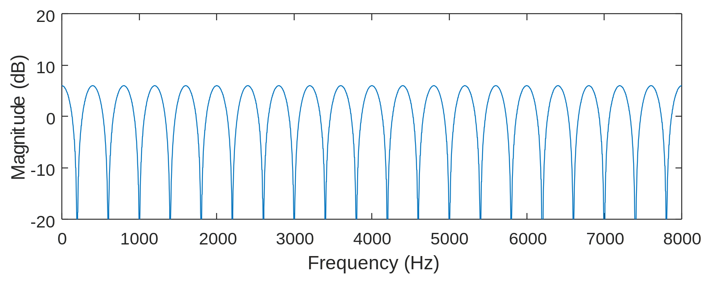
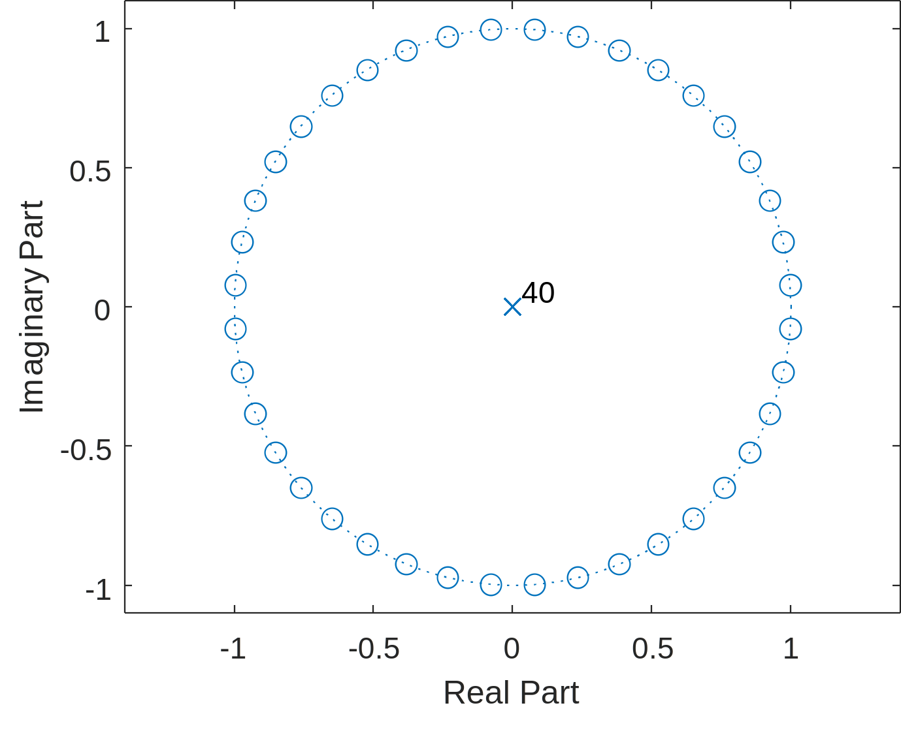
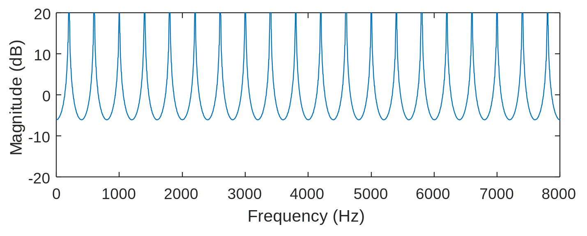
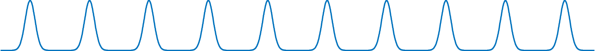
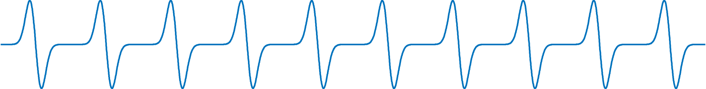
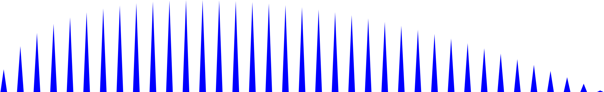
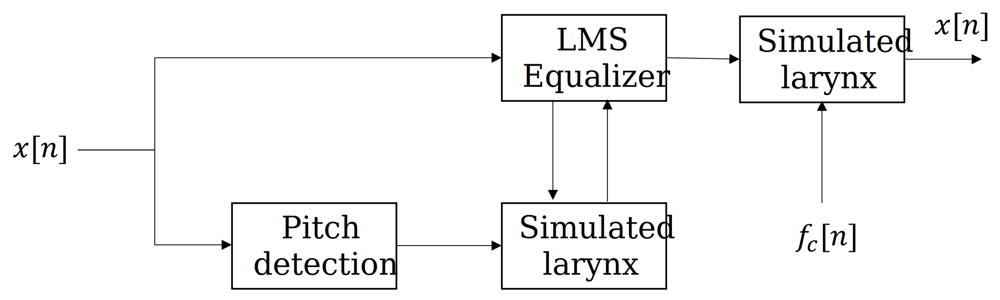

# Lab 7 Primer

With all of the tools previously developed, we are equipped to build a plethora of real-time systems with creative applications. In particular, most musical effects can be implemented with a relatively small computational load. This makes it feasible to run many different effects on cheap, reprogrammable systems.

The Nyquist Shannon-sampling theorem equips us to build an infinite number of audio effects digitally, but we will focus on four types of effects

* Comb filters
* Harmonic Distortion
* Amplitude Modulation
* Vocoder

Many of the most well-known audio effects are variations or combinations of these basic systems.

## Comb filters

The effect of adding signal with a delayed version of itself is often referred to as a "comb filter." These filters can be further categorized as either feedforward (FIR) or feedback (IIR) comb filters.

### Feedforward

Consider the effect of adding an input signal $x[n]$ with a scaled and delayed version of itself $\alpha x[n-K]$


It is very easy to describe this system using a difference equation and to find the impulse response $h[n]$

$$y[n] = x[n] + \alpha x[n-K]$$

$$h[n] = \delta [n] + \alpha \delta[n-K]$$

Equivalently, we could express this as a set of filter coefficients:

```
>> K = 5; b = [1, zeros(1,K), 1]

b =

     1     0     0     0     0     0     1
```

The magnitude response of this system has several nulls at equally spaced frequencies.

```
K = 39; b = [1, zeros(1,K), 1]; freqz(b,1,n,16000)
```



Recall that a notch filter can be created by placing zeros at an angle of the desired notch frequency. The feedforward comb filter can be thought of as cascading several notch filters, resulting in zeros at equally spaced angles around the unit circle:

```
zplane(h,1);
```



Although this example is a 40th order FIR filter, the computational complexity is low because nearly all of the filter coefficients are zero.

### Feedback

If an input signal $x[n]$ is instead added with a delayed version of the output, it results in an all-pole IIR filter:


$$ y[n] = x[n] + \alpha y[n-K] $$

```
K = 39; a = [1, zeros(1,K), 1]; freqz(1,a,n,16000)
```



## Variations

### Echo/Delay

With sufficiently high delay $K$, the comb filter becomes an audible echo. If the IIR form is used, it will create multiple echos.

### Allpass

If the same delay $K$ is used for both a feedforward and a feedback term, the result in a perfectly flat magnitude response but a nonlinear phase response, These effects are often referred to as "Allpass" filters.

### Flanger

A flanger is a comb filter whose delay $K[n]$ slowly oscillates within some range $\pm R$

$$y[n] = x[n] + \alpha x\left[n-K[n]\right]$$

$$K[n] = R \cos(\omega_{\text{flanger}}) + \frac{R}{2}$$

The time-varying nature of the delay characterizes the flanger. Typically, the overall delay is very short. Although the example above uses a cosine, any periodic function could be used.

## Chorus

Typically, a "chorus" effect consists of adding three or more flangers running in parallel each with it's own set of parameters. 

## Phaser

The "phaser" effect can be implemented by slowly varying the frequency of a notch filter that is applied to the input and added back to the original signal.

## Reverb

Reverb simulates acoustic propagation effects. For example, a reverb effect might emulate the wall reflections in a large concert hall. Since the acoustic effects they emulate can be complex, their implementations vary widely. Reverb effects often consist of several comb filters combined with one or more allpass filters. However, since they attempt to replicate acoustic effects of some environment, they are time-invariant.

## Harmonic Distortion

Recall that a Fourier series can represent any periodic signal as a combination of a fundamental frequency and equally spaced harmonics. However, if the signal or its derivative contain discontinuities, it requires an infinite number of harmonics.

Many types of nonlinearities might introduce discontinuities. For example, when the linear range of an amplifier is exceeded, clipping will occur which introduces additional harmonics.

For most systems, the introduction of new frequencies is a type of impairment. For musical applications, addition of harmonics can make an instrument have greater presence and warmth.

Many types of nonlinearities can produce harmonic distortion. As a result, this category of effects often goes by many names:

* Distortion
* Fuzz
* Overdrive
* Bit crusher

##

## Amplitude Modulation

Any effect which only modifies the amplitude and not the phase can be considered "amplitude modulation"

### Tremolo

Tremolo refers to the effect of scaling the input by $\beta[n]$ which osillates between some positive range. For example:

$$ y[n] = x[n]\beta[n] $$

$$\beta[n] = \frac{1}{2} \left(1 + \cos(\omega_{\text{tremolo}}n) \right)$$

### Ring modulation

If the input is scaled by an oscillating factor which is allowed to be negative, the effect is instead referred to as "ring modulation"

$$\beta[n] = \cos(\omega_{\text{ring}}n)$$

Tremolo can be considered a specific type of ring modulation.

## Vocoder

Originally, the vocoder (voice encoder) was intended for applications of speech synthesis and compression. However, the term has since become synonymous with various musical effects used to combine a speech signal with a musical instrument.

### Modeling speech

The [source-filter model][1] of speech is ubiquitous for speech synthesis. Most operating systems include speech synthesizers utilizing this model which can be accessed easily in MATLAB.

```
NET.addAssembly('System.Speech');
speech_synth = System.Speech.Synthesis.SpeechSynthesizer;
Speak(speech_synth,'Put your hands up. This is a filter bank robbery');
Dispose(speech_synth);
```

```{raw} html
<audio controls="controls">
     <source src="../_static/example.wav" type="audio/wav">
</audio>
```

The source is typically modeled on the pressure wave that occurs when the vocal folds repeatedly open and close. We can model this as a pulse which is modulated by an impulse train.



The pressure wave can be modeled as the derivative of this signal.



In the frequency domain, the result is concentration of energy at evenly spaced harmonics



The spacing of these harmonics is 'pitch', and their envelope contains the remaining phonetic information.

A [vocoder][2] attempts to to find the time-varying parameters to a speech model from a recording. Since the sophistication of speech models varies widely, so does the sophistication of vocoders. However, the main principles can be demonstrated with just a three subsystems: (1) a source model (above), (2) [pitch detection][3], and (3) an [adaptive filter][4].

For a musical applications, the vocoder might rencode the speech with a new frequency $f_c$ (autotune), or apply the learned filter model to a separate input signal, like a guitar.



### Autocorrelation for pitch detection

Suppose that we want to estimate the time-varying fundamental frequency $f_0$ of a speech recording with an update rate of about 25 Hz. We can divide the input signal into frames which are roughly $\frac{1}{25 \text{ Hz}} = 40 \text{ ms}$ long. For a sampling rate of 48 kHz, this would mean that we want to produce an estimate every $\frac{48 \text{ kHz}}{25 \text{ Hz}} = 1920$ samples, though for convenience we will round this to to a power of two (2048).

```
[y,fs] = audioread('example.wav'); y = resample(y,320,147); fs = 48e3;
L = 2048; N = floor(length(y)/L); y(N*L+1:end) = []; y = reshape(y,L,N);
```

The fundamental period of the signal is $T_0 = 1/f_0$. Therefore, the autocorrelation should have a peak at this offset. This fact leads to a simple pitch detection algorithm.

1. Find the offset $N_0$ (in samples) where the peak autocorrelation occurs (subject to a constraint).

2. Estimate that the signal in the frame is periodic with fundamental frequency $\omega_0 = \frac{1}{N_0} \frac{\text{radians}}{\text{sample}}$.

The constraint in step one is that the estimated frequency should be in the normal vocal range of about 50 to 250 Hz. Or equivalently, the offset should be between $\frac{48 \text{kHz}}{250 \text{Hz}} \approx 200$ samples and $\frac{48 \text{kHz}}{50 \text{Hz}} \approx 1000$ samples.

```
R = @(x,n) sum(x(n+1:end) .* x(1:end-n));
Rn = []; N0 = [];
for i_frame = 1:N
R_max = 0; n_max = 0;
for n = 200:1000
    Rn(i_frame) = R( y(:,i_frame), n);
    if Rn(i_frame) > R_max
        R_max = Rn(i_frame); n_max = n;
    end
    N0(i_frame) = n_max;
    Rn(i_frame) = R_max;
    end
end
```

### Simple model of vocal source

Any waveform that matches the desired fundamental frequency and has energy widely distributed among harmonics is suitable to simulate the vocal source. For this example, we will use the (derivative of) a gaussian pulse which has been modulated by an impulse train of the desired period. We will use the magnitude of the autocorrelation to control the volume and avoid changing frequencies when no voiced speech is present.


```
x1 = [];
period = 600;
for i_frame = 1:N
    if Rn(i_frame)>2
        period = N0(i_frame);
    end
    waveform1 = diff(gausswin(period,30));
    for i_sample = 1:L
        i_x = L*(i_frame-1) + i_sample;
        i_w = mod(i_sample,length(waveform1));
        i_w = i_w + (i_w == 0);
        x1(i_x) = (waveform1(i_w)) * abs(Rn(i_frame));
        if i_sample > L - period
            x1(i_x) = x1(i_x) * ((L - i_sample)/period);
        end
    end
end
```

### Modeling the vocal tract

Now that we have a model of the source, we can attempt to learn (for each new sample) an LTI approximation of the articulatory filter (lips, tounge, pharynx, etc). Many adaptive filtering techniques exist for this task, Though it has some limitations, [Least mean square filter][5], could be used for this application.

```
y = y(1:length(x1));
n=513; h=zeros(n,1);
mu=.001; delta=256;
p1 = []; p2 = [];
for i_sample=n+1:length(y)
    t1 = x1(i_sample : -1 : i_sample-n+1)';
    p1(end+1) = dot(t1,h);
    e = y(i_sample-delta) - p1(end);
    h = h + mu*e*t1;
end
soundsc(p1,fs)
```

```{raw} html
<audio controls="controls">
     <source src="../_static/example2.wav" type="audio/wav">
</audio>
```

## Applications

The example above encodes the speech into a time-varying frequeny $f_0$ and a time-varying filter $h$. With this description of the signal, many applications are possible:

* Replace the source with a musical instrument with energetic harmonics, (like a guitar, violin, or synthesizer), but use the learned time-varying filter to make the instrument 'speak'. (demonstrated in the lab exercise)

* Exploit the fact that the parameterized representation contains fewer bits for speech compression.

* Modify the parameters based on other information about the signal to perform denoising or source separation.

[1]:https://en.wikipedia.org/wiki/Source–filter_model
[2]:https://en.wikipedia.org/wiki/Vocoder
[3]:https://en.wikipedia.org/wiki/Pitch_detection_algorithm
[4]:https://en.wikipedia.org/wiki/Adaptive_filter
[5]:https://en.wikipedia.org/wiki/Least_mean_squares_filter